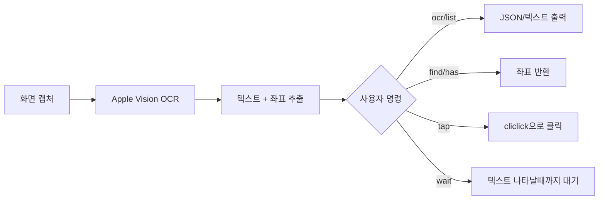
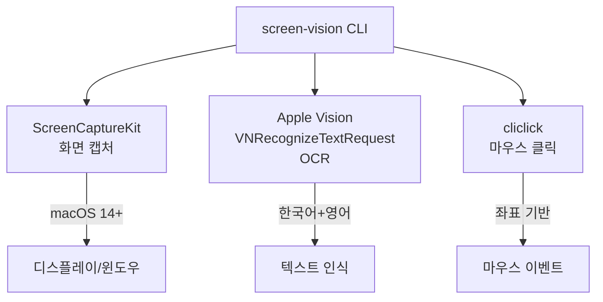
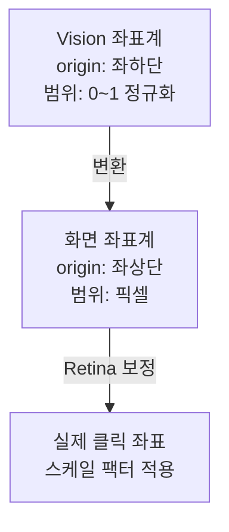

# screen-vision — Product Documentation

## 한 줄 요약

**macOS 화면에서 텍스트를 읽고, 찾고, 클릭하는 CLI 도구.**

---

## 무엇을 하는 도구인가

screen-vision은 macOS 화면(전체/앱 윈도우/특정 영역)을 캡처한 뒤, Apple Vision 프레임워크로 OCR을 수행하여 텍스트와 화면 좌표를 추출한다. 추출된 좌표를 이용해 특정 텍스트를 찾거나 클릭할 수 있다.



## 왜 만들었나

원래 **토스 포스(Toss POS)** 매출 리포트 엑셀 추출 자동화를 위해 만든 `toss-vision`이 시작이었다. 그런데 코드를 보니 토스 전용 로직이 전혀 없었고, `--app` 옵션으로 아무 앱이나 지정할 수 있는 범용 도구였다. 그래서 이름과 기본값을 바꾸고, 별도 레포로 분리하여 누구나 쓸 수 있도록 배포했다.

## 누가 쓰는가

- **AI 코딩 에이전트** (Claude Code, OpenClaw 등): 화면 상태를 OCR로 확인하고 자동화
- **macOS 자동화 스크립트 작성자**: shell 스크립트에서 GUI 앱 자동화
- **RPA/테스트 자동화**: 앱 UI 텍스트 기반 검증 및 조작

---

## 핵심 기술 스택



| 기술 | 역할 | 요구사항 |
|------|------|----------|
| **ScreenCaptureKit** | 화면/윈도우/영역 캡처 | macOS 14.0+, Screen Recording 권한 |
| **Apple Vision** (VNRecognizeTextRequest) | 이미지 → 텍스트 + 좌표 | macOS 내장 |
| **cliclick** | 좌표 기반 마우스 클릭 | `brew install cliclick` (tap 명령용) |
| **Swift 5.9** | 빌드 언어 | 소스 빌드 시에만 필요 |

---

## 커맨드 체계

### 캡처 우선순위

```
--region x,y,w,h  >  --app "앱이름"  >  전체 화면 (기본)
```

### 전체 커맨드

| 커맨드 | 설명 | 출력 | 주 용도 |
|--------|------|------|---------|
| `ocr` | 전체 OCR | JSON `[{text, x, y, w, h, confidence}]` | 화면 분석, 파이프라인 |
| `list` | OCR (사람용) | 줄별 텍스트 + 좌표 | 디버깅, 상태 확인 |
| `find "text"` | 텍스트 찾기 | JSON `{text, x, y, found}` | 좌표 추출 |
| `has "text"` | 텍스트 존재 여부 | exit code 0/1 | shell 조건문 |
| `tap "text"` | 찾기 + 클릭 | JSON `{text, x, y, tapped}` | UI 조작 |
| `wait "text"` | 텍스트 나타날때까지 대기 | JSON `{text, x, y, found}` | 로딩 대기 |

### 옵션

| 옵션 | 적용 대상 | 설명 |
|------|-----------|------|
| `--app NAME` | 모든 커맨드 | 특정 앱 윈도우만 캡처 |
| `--region x,y,w,h` | 모든 커맨드 | 화면 특정 영역만 캡처 |
| `--retry N` | tap만 | N회 재시도 (1초 간격) |
| `--timeout SEC` | wait만 | 최대 대기 시간 (기본 30초) |

---

## 텍스트 매칭 로직

```
1. exact match (대소문자 무시): "OK" == "ok" ✓
2. partial match (포함): "Cancel Order" contains "cancel" ✓
3. exact가 있으면 partial보다 우선
```

---

## 좌표 시스템



- Vision의 `boundingBox`: 좌하단 원점, 정규화(0~1)
- 화면 좌표: 좌상단 원점, 픽셀 단위
- Retina 디스플레이: 이미지 크기와 화면 크기가 다름 (scaleX/Y 적용)
- 출력 좌표: bbox 중앙점 (centerX, centerY)

---

## 배포 채널

| 채널 | 명령어 | Xcode 필요 | 대상 |
|------|--------|-----------|------|
| **curl** (추천) | `curl -sL .../arm64-macos.tar.gz \| tar xz -C /usr/local/bin/` | X | Apple Silicon |
| **Homebrew** | `brew install jackyun1024/tap/screen-vision` | ARM: X, Intel: O | brew 사용자 |
| **ClawHub** | `npx clawhub install screen-vision` | X | OpenClaw 사용자 |
| **소스 빌드** | `swift build -c release` | O | 개발자 |

### 관련 레포

- 소스: [jackyun1024/mac-screen-vision](https://github.com/jackyun1024/mac-screen-vision)
- Homebrew tap: [jackyun1024/homebrew-tap](https://github.com/jackyun1024/homebrew-tap)
- ClawHub: `screen-vision@1.2.0`

---

## 사용 사례

### 1. AI 에이전트 화면 자동화 (주 사용처)

```bash
# 토스 포스 매출 리포트 자동 추출 (toss-pos-sales 스킬)
TV() { screen-vision "$@" --app "Toss POS"; }
TV has "매출 리포트" || fail "화면 아님"
TV tap "엑셀 내보내기" --retry 3
TV wait "파일 만들기" --timeout 30
TV tap "파일 만들기"
```

### 2. shell 스크립트에서 GUI 앱 검증

```bash
# 앱 상태 확인 후 조건 분기
if screen-vision has "로그인" --app "MyApp"; then
    screen-vision tap "로그인" --app "MyApp"
fi
```

### 3. 화면 디버깅

```bash
# 지금 화면에 뭐가 보이는지 확인
screen-vision list --app "Safari"
```

---

## 제약사항

| 제약 | 원인 | 우회 방법 |
|------|------|-----------|
| macOS 14.0+ 필수 | `SCScreenshotManager.captureImage` API | 없음 (하위 버전 미지원) |
| Screen Recording 권한 필수 | ScreenCaptureKit 요구 | 시스템 설정에서 터미널 앱 추가 |
| 한국어 + 영어만 인식 | `recognitionLanguages` 설정 | 코드 수정으로 언어 추가 가능 |
| tap 명령에 cliclick 필요 | 마우스 클릭 구현체 | `brew install cliclick` |
| Intel Mac pre-built 없음 | arm64만 빌드 | 소스 빌드 필요 |

---

## 버전 히스토리

| 버전 | 날짜 | 내용 |
|------|------|------|
| v1.0.0 | 2026-03-20 | 초기 릴리스 (ocr, list, find, has, tap, wait) |
